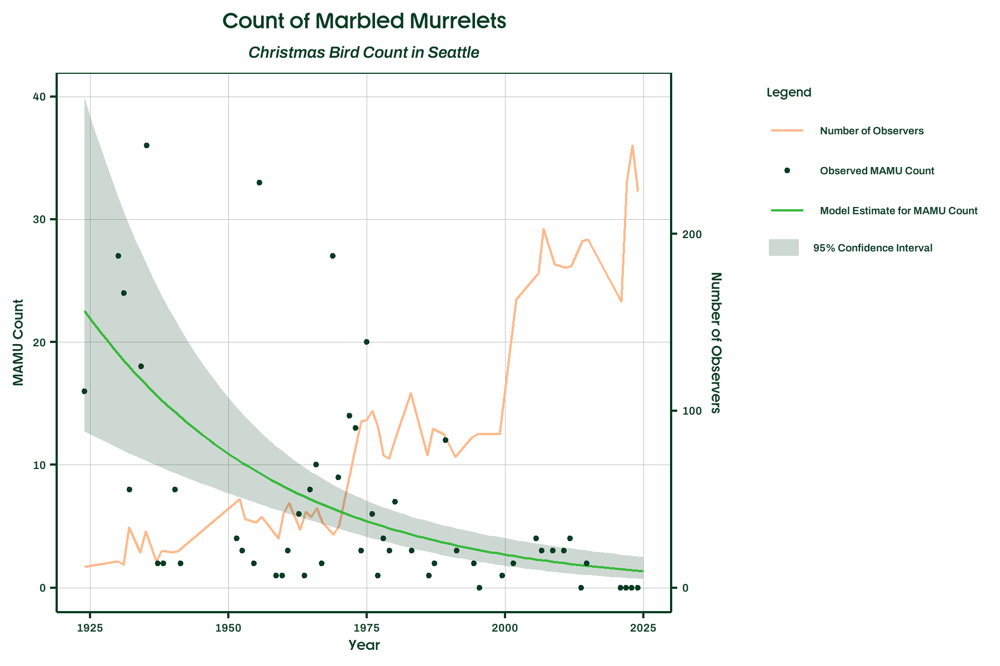

# Trend analysis of historical Christmas Bird Count observations of Marbled Murrelet in Seattle
September 24, 2025

Author: Joshua Morris, Conservation Director, Birds Connect Seattle

Contact: joshm@birdsconnectsea.org / info@birdsconnectsea.org

## About
In June 2025, Washington Department of Fish and Wildlife (WDFW) began soliciting public comments on a draft Periodic Status Review for the Marbled Murrelet. Birds Connect Seattle concurrs with the Department's recommendation to retain state "Endangered" status.

The Marbled Murrelet occurrs in Puget Sound year-round, with some known areas of winter concentration. Given this seasonal pattern, we suggest that historical Christmas Bird Count (CBC) data can further support WDFW's recommendation. 

The CBC is the longest-running community science project in history. Counts have occurred every December for more than a century, with volunteer surveyors conducting a systematic count of all birds within a given area. Birds Connect Seattle (formerly Seattle Audubon Society) has coordinated the CBC in Seattle since our founding in 1916. Participants conduct both boat- and shore-based counts to ensure seabirds like the Marbled Murrelet are documented.

#### Study area and time period
I analyzed CBC Marbled Murrelet observations from Seattle from 1924 to 2024. Counts from 2022 through 2024 were not included in the historical data download at the time of access, so I added those data from Birds Connect Seattle's records (no Marbled Murrelet were observed in those years). The observations were made within the Seattle count circle (code "WASE"). More information on CBC count circles at https://gis.audubon.org/christmasbirdcount/

#### Statistical modeling approach
To identify count trends, I evaluated the performance of various generalized linear models with Marbled Murrelet counts as the response variable and year alone or year plus search effort as predictor variables. Models assuming a Poisson distribution exhibited overdispersion and zero inflation, both of which were resolved by using a negative binomial distribution. Akaike Information Criterion (AIC) values indicated stronger support for a negative binomial 2 distribution than a negative binomial 1 distribution. In all models, year was statistically significant (p < 0.01), while search effort was not significant. The final model included Marbled Murrelet counts as the response variable and a z-standardized year term as the sole predictor variable, using a negative binomial 2 distribution with a log link function. 

#### Results
Model results show Marbled Murrelet counts have declined an average of an average rate of -2.75% per year [95% CI: -3.79% to -1.71%], representing a cumulative decline of 94% between 1924 to 2024. While search effort was not a significant predictor of Marbled Murrelet counts, we note that we observe the steep count declines concurrent with increasing observer effort. 

## Data Availability
More information about CBC data at christmasbirdcount.org. 

Historical CBC data by species available for download at https://netapp.audubon.org/CBCObservation/Historical/ResultsBySpecies.aspx?1

- Step 1: Select species

  - Common name: Marbled Murrelet

  - Scientific name: *Brachyramphus marmoratus*

- Step 2: Select year range

  - Start year: 1900

  - End year: 2024

- Step 3: Select country and/or region, or enter circle code

  - Circle Code: WASE

